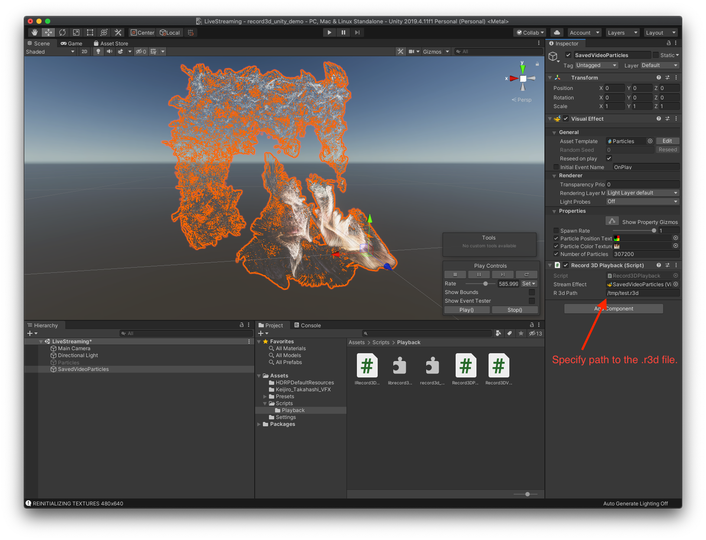
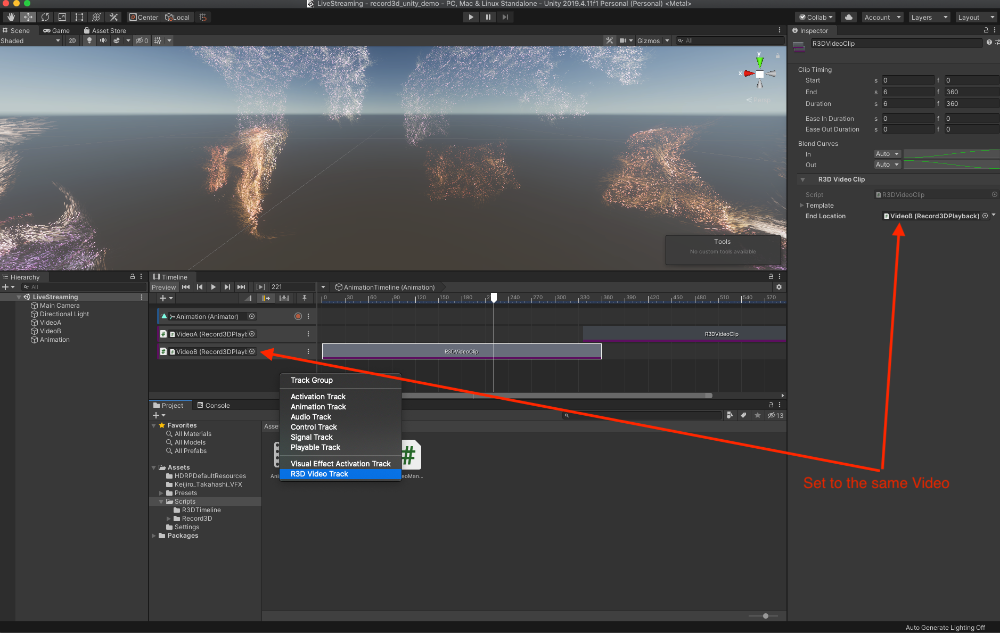

# VVESP (Volumetric Video Editing, Streaming, and Playback)
Composed of a 3D video editor, and a simple streaming/playback system, my hope is to 1) provide developers with a simple framework to create 3D movies using consumer devices (i.e., iPhone, Quest), and 2) use it to make my own 3D movies. 

**The goal is to provide a seamless experience in manipulating 3D videos, adding effects, and merging them with virtual environments.**

## Roadmap
- [ ] Building our file-system explorer to load different datasets
- [ ] Simplified way to connect to servers on different networks
- [ ] Integrating LiteNetLib for simple server/client connectivity
- [ ] Integrating WebRTC for more robust p2p streaming
- [ ] Building out server-side application, leveraging AI for style transfer and segmentation
- [ ] Playback Hand Gestures + virtual controller
- [ ] Building out streaming-client for livestream
- [ ] Utilizing telemetry data to move vfx projection exactly as captured
- [ ] Support multiple streams
- [ ] Stream configuration files (includes quality details, data representation types)

### Technical Details

Under the hood, the system is built with various Unity frameworks and SDKs like Barracuda, URP, VFX Graph, Quest Integration, and ARKit. Key influences include work by Keijiro Takahashi and Marek Simonik, my work stems from their work. I’ve ported existing libraries to the Quest platform and written custom C++ libraries — loaded as linked libraries — to enhance performance for various tasks. The editor features multi-track support with customizable VFX graphs for various data types like voxels and point clouds. It offers flexible control over visual (# of particles, size of particles) and temporal properties (how frequently frames are updated). Further, developers can programmatically specify quality configurations for different elements (e.g., high for faces, medium for bodies, and low for environments). Users benefit from features like body segmentation and the ability to merge 3D videos with advanced cropping tools. The system also incorporates community-contributed style transfer models and VFX graph effects.

This project is built on top of [Record 3D Repository](https://github.com/marek-simonik/record3d_offline_unity_demo). The rest of this readme includes readme from the linked repository.

## Archived READMe

**2021/07/28 Update**: LiDAR videos recorded with the "Higher quality LiDAR recording" option are now supported! **Download the new `librecord3d_unity_playback.dylib` and/or `record3d_unity_playback.dll` file** (read below).

This demo is shows how to replay already recorded [Record3D app's](https://record3d.app/) 3D Videos using Unity's VFX Graph. It is based on the [Live Streaming Unity demo](https://github.com/marek-simonik/record3d_unity_demo), but instead allows you to replay exported `.r3d` 3D Videos made by Record3D.

*Note that this is an alpha- / beta-quality demo.*

Screenshot 1: Specifying `.r3d` file path (detailed instructions below):

### Acknowledgements

This project contains a modified [Particles VFX](https://github.com/keijiro/Rsvfx/blob/master/Assets/Test/Vfx/Particles.vfx) of [Keijiro Takahashi](https://github.com/keijiro) which demonstrates how to integrate Record3D pre-recorded video playback into an existing VFX Graph.

### What will you need?
- A 3D Video created by [the Record3D iOS app](https://record3d.app), exported into the `.r3d` format. The best effect is achieved with 3D Videos made using the selfie FaceID camera.
- Unity 2019.4.11 or newer.

### Before opening the Unity project
As this demo is based on the [Live Streaming Unity demo](https://github.com/marek-simonik/record3d_unity_demo), it was necessary to create a new C++ library that would adjust behavior of the existing bridging library (https://github.com/marek-simonik/record3d_unity_streaming) to facilitate offline playback.

If you are on macOS, then you will need to copy the `librecord3d_unity_playback.dylib` file (`Assets > Scripts > Record3D > Playback > librecord3d_unity_playback.dylib`) into `/usr/local/lib`.

For Windows users, there is the same library (`Assets > Scripts > Record3D > Playback > record3d_unity_playback.dll`). However, on Windows, you do not need to copy the `.dll` to `C:\Windows\System32` — it is enough to keep the `.dll` in the same folder as it is now and everything should work.

### After opening the Unity project

1. In Record3D, export a 3D Video into the Shareable/Internal (.r3d) format and copy the `.r3d` file to your computer.
1. Open the LiveStreaming scene (`Assets/LiveStreaming.unity`) of this Unity project.
1. There are two sample video objects in the `LiveStreaming` scene — `VideoA` and `VideoB`. For simplicity, you can remove the `VideoA` object so that just one 3D Video is replayed (you can set the same `.r3d` video for both video objects though).
1. Select the `VideoB` object and specify file path to the `.r3d` file for the Record3DPlayback script — **see the screenshot above**.
1. \[Optional\] Playback of the videos is controlled via Unity's Timeline feature, so you can [open the Timeline window](https://docs.unity3d.com/2019.2/Documentation/Manual/TimelineEditorWindow.html) and rearrange the timing of the videos. Multiple videos can be added. **See the screenshot below**.
1. Press the Play button in Unity and you should see the 3D Video start to move.

Screenshot 2: Timeline setup:

### Controlling the playback programmatically
The `Record3DPlayback.cs` script has a simple API for loading 3D Videos, playing/pausing them and loading a specific frame of the 3D Video programmatically (i.e. `LoadVideo(path_to_r3d_file)`, `Play()`, `Pause()`, `LoadFrame(frameNumber)`). You can attach the script to an object (can be attached e.g. to a VFX Graph object which you want to play the video in), then specify the `.r3d` file path and the VFX Graph object which the video should be played in (as can be seen in the first screenshot) and then all is set up.

In the demo, the `Animation` object drives the animation using the Unity Timeline feature, but you do not need to use the Timeline. To control a 3D Video programmatically, just get the reference to the object the `Record3DPlayback` script is attached to (`Record3DPlayback videoPlayer = gameObject.GetComponent<Record3DPlayback>();`) and call e.g. `videoPlayer.LoadFrame(35)` to load frame number `35` (you can read the total number of frames and FPS of the loaded video too to create your custom logic around playback).

The `Animation` object demonstrates how to play the videos in an easy way, but you don't need to use it — it is enough to just utilize the `Record3DPlayback` script and create your own playback logic by loading the individual frames of the video at specified intervals (according to FPS of the video).

You can contact me at support@record3d.app if you have any questions or encounter problems.
